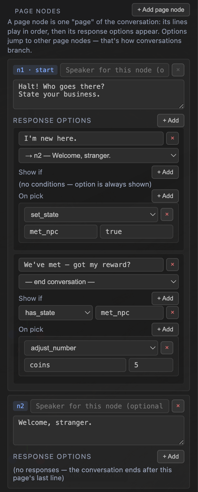
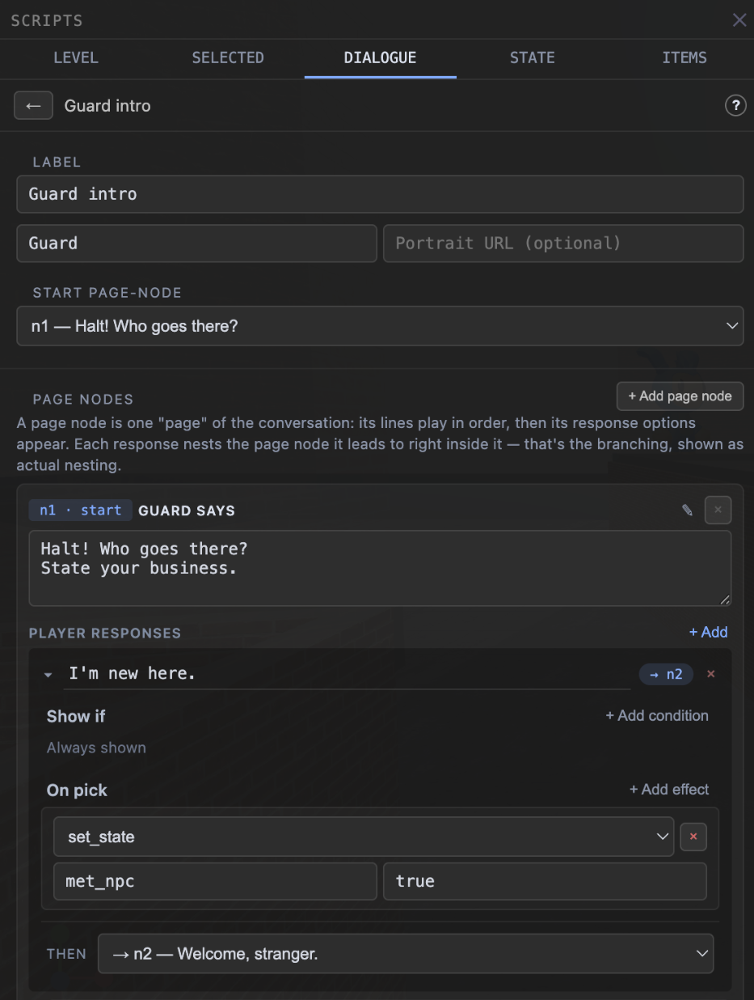
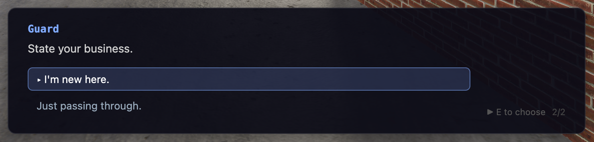

# Dialogue Trees — Authoring Guide

How to create and manage branching NPC conversations in the World Editor.
Written for humans clicking through the UI; the JSON reference at the end is
for hand-authoring or debugging. (Shipped in Phase 30 / v4.24.0 — the
architecture doc has the engine-level details.)

---

## The mental model

A **dialogue** is a small flowchart:

```
        n1  "Halt! Who goes there?"
            "State your business."
       ┌────┴──────────────────────────────┐
  "I'm new here."                  "We've met — got my reward?"
  (sets met_npc)                   (only shown if met_npc is set;
   → goes to n2                     gives 5 coins) → ends
       │
        n2  "Welcome, stranger."
            "Thanks. Bye." → ends
```

Three building blocks:

| Thing | What it is |
|---|---|
| **Page node** | One "page" of the conversation: the NPC's lines (shown one at a time, confirm to advance), followed by the player's response options. |
| **Response option** | One player response. It can be **gated** (hidden unless its "Show if" conditions pass), can **do things** when picked (its "On pick" effects — set flags, give items, any script action), and either **jumps to another node** or **ends** the conversation. |
| **Tree** | The whole conversation: a label (for you), a speaker name (shown in-game), a start node, and its nodes. Each tree gets an id like `dlg_a1b2c3d4` that scripts reference. |

> **Why "node"?** (Labeled **PAGE NODES** in the editor.) A conversation is
> a flowchart (a *graph*, in math terms), and the standard name for a point
> in a graph is a node — the response options are the arrows between them. Every branching-dialogue tool
> uses some flavor of this word (Twine calls them passages, Ink calls them
> knots, Yarn calls them nodes too). Practically, just read "node" as **"one
> screen of talk"**. Their ids (`n1`, `n2`, …) are auto-numbered and only
> matter as jump targets — the next-node dropdown shows each node's first
> line next to its id so you rarely think about the numbers.

Two rules cover most of the behavior:

1. **Branching happens only through options.** A node with no options (or
   whose options are all hidden by their conditions) simply ends after its
   last line.
2. **Conditions are re-checked every time a node is shown** — so an option
   that sets a flag can unlock a different option later in the *same*
   conversation, or change what the NPC offers next time you talk to them.

### What that looks like in the editor

The editor doesn't draw the flowchart — it shows the tree as a **vertical
stack of page-node cards**, and the branching lives in each response option's
**next-node dropdown**. Two options on the same card pointing at different
targets *is* the fork. Here's the conversation from the chart above, compact:

```
        n1  "Halt! Who goes there?"
       ┌────┴───────────────────────────┐
  "I'm new here."             "We've met — got my reward?"
   → goes to n2                (gated; gives 5 coins) → ends
       │
        n2  "Welcome, stranger."  → ends
```

…and here is that exact conversation authored in the DIALOGUE tab — one
continuous view of the PAGE NODES section, two node cards:



Reading the image against the chart:

- **n1's card** holds the NPC's two lines and both response options. The two
  next-node dropdowns are the chart's two arrows: `→ n2 — Welcome, stranger.`
  is the left arrow, `— end conversation —` is the right one.
- The second option's **Show if** row (`has_state · met_npc`) is the chart's
  "only shown if met_npc is set", and its **On pick** row (`adjust_number ·
  coins · 5`) is "gives 5 coins".
- **n2's card** underneath is the chart's n2 box — no response options, so
  the conversation just ends after its line.
- The cards' top-to-bottom order is only storage order. The *shape* of the
  conversation — what branches where — is entirely in where each option's
  dropdown points.

---

## Creating a dialogue

1. Open the **SCRIPTS** panel (bottom-left toolbar) and switch to the
   **DIALOGUE** tab.
2. Click **+ New**. You get a fresh tree with one page node (`n1`) already
   set as the start page-node.
3. Fill in the top fields:
   - **Label** — your name for it ("Guard intro"). Only shown in the editor.
   - **Speaker** — the name displayed above the dialogue text in-game.
   - **Portrait URL** — optional image shown beside the text.
   - **Start page-node** — which page node plays first (usually `n1`; you
     rarely change this).
4. Type the NPC's lines into the node's textarea — **one line per row**; the
   player presses E (or A / tap) to step through them. The node card's other
   pieces: the blue **`n1 · start`** badge is the node's id (jump target —
   hover it for a reminder), and **"Speaker for this node"** optionally
   replaces the dialogue's Speaker while that node is on screen (for a second
   character butting into the conversation).

Here's the whole editor with a one-node dialogue staged — label and speaker
up top, the start-node picker, then the node card with its lines and options:



### Adding responses

Under a node's **RESPONSE OPTIONS**, click **+ Add**:

- **Response text** — what the player sees, e.g. `Who are you?`
- **Next-node dropdown** — where picking it leads:
  - a node (`→ n2 — Welcome, stranger.`), or
  - **— end conversation —** to close the dialogue.
- **Show if** (+ Add) — conditions; the option is *hidden* unless **all**
  pass. With none added, the row reads *"(no conditions — option is always
  shown)"* — that's the default, not a warning:
  - `has_state <key>` — the flag/key is set (and not false/null).
  - `compare_number <key> <op> <value>` — numeric check, e.g. `coins >= 5`.
- **On pick** (+ Add) — effects that run the moment the player picks it
  (empty rows say so: *"nothing happens yet — add effects that run when
  picked"*). Any script action works; the ones you'll use most:
  - `set_state` — set a flag: key `met_guard`, value `true`.
  - `adjust_number` — add/subtract a counter: key `coins`, delta `-5`.
  - but also `play_sound`, `teleport_player`, `despawn_object`,
    `fade_screen`, `load_scene`, even `show_dialogue` (hands off to another
    tree).

### Adding more page nodes — making it branch

**+ Add page node** creates `n2`, `n3`, … Deleting one is the **×** on its
card — the start page-node can't be deleted (pick a different start
page-node first).

A new page node does nothing until an option points at it, so the full
recipe for an actual branch is:

1. **+ Add page node** — an empty `n2` card appears below `n1`. Type its
   lines (what the NPC says on that branch).
2. On `n1`, **+ Add** a response option and type its text ("I'm new here.").
3. Open that option's **next-node dropdown** and pick **`→ n2 — …`**. That
   dropdown selection *is* the branch — there's no separate "connect" step.
4. **+ Add** a second option on `n1` and leave its dropdown on
   **— end conversation —** (or point it at a different node).
5. That's a fork: two options, two destinations. Repeat from step 1 to fan
   out further (a third option → `n3`, an option on `n2` → `n4`, …).

What you just built:

```
        n1 ── option A ──→ n2
          └── option B ──→ (end)
```

…which is exactly the layout in the [branching screenshot](#what-that-looks-like-in-the-editor)
up in the mental-model section: the fork never appears as lines on screen,
only as two dropdowns with different targets.

> **"Give / receive items":** define items in the **ITEMS** tab (label, icon,
> description, stack size, starting count), then use the typed pieces with
> their item-picker dropdowns: On pick → **`give_item`** ("hand over a key")
> or **`take_item`** ("charge 5 coins"), Show if → **`has_item`** with its
> comparison dropdown ("can afford it" = `≥ 5`, "looks broke" = `< 5`). What
> the player holds shows up in the in-game **bag** (I / Tab, gamepad Y,
> touch 🎒), and items persist across scene loads and save games like any
> other state. For everything about items, state, and schemas — including a
> full shop recipe — see **`STATE_ITEMS_GUIDE.md`**.

---

## Hooking a dialogue to an NPC (or anything else)

A dialogue doesn't play by itself — a script's `show_dialogue` action starts it.

**Talk-to-NPC (the usual case):**

1. Place your NPC object. In Properties, check **Interactable** (optionally
   set a prompt label like "Talk").
2. With it selected: SCRIPTS → **SELECTED** tab → **+ New**.
3. Trigger = `on_interact` (target is the selected object, implicit).
4. **+ Add** action → `show_dialogue` → pick your dialogue from the dropdown.
   (The dropdown lists this zone's dialogues; the hint reminds you they're
   managed in the DIALOGUE tab.)

Any other trigger works the same way — a trigger volume's `on_player_enter`,
a level's `on_game_start`, `on_timer`, etc.

**Reacting to a conversation ending:** the `on_dialogue_end` trigger fires
whenever a dialogue closes — whether the player picked an end option, finished
the last line, or **cancelled out** (Start/Enter/✕ — cancelling counts as
ending). Target it at a specific dialogue from the dropdown, or leave it as
"any dialogue". Example: a LEVEL script `on_dialogue_end` targeting
`dlg_guard_intro` that opens a gate once the intro has been heard.

---

## Playing it

Enter preview/game (▶) and interact. On the last line, the options appear —
the highlighted row has the `▸` marker and the footer flips to "E to choose":



- **E / A / tap** advances lines until the options show.
- **Arrow keys or W/S** (keyboard), **d-pad or a left-stick flick** (gamepad)
  move the highlight; **E / A** picks. Mouse click or
  tap picks a row directly.
- Movement is frozen while a dialogue is open; **Enter / Start / ✕** closes it
  (that's the "cancel" that still fires `on_dialogue_end`).

Remember the split that applies to all scripting: **state changes persist,
world changes don't**. Flags and counters set by options are real gameplay
state (saved, carried across scenes). Visual effects (despawn, material swap)
are runtime-only and reset when you leave preview.

---

## Validation & gotchas

The editor warns but never blocks saving — the runtime degrades gracefully:

- **Red option border + "next node doesn't exist"** — the option points at a
  deleted node. In-game it just ends the conversation. Fix via the next-node
  dropdown (the broken id shows as `(missing!)`).
- **"⚠ Unreachable nodes: …"** — nodes nothing points to. They're harmless
  dead weight; either wire an option to them or delete them.
- **All of a node's options gated off** — if every option's conditions fail,
  the node behaves like it has no options: the dialogue ends after its lines.
  Deliberately useful ("nothing more to say until you find the key"), but
  check it's what you meant.
- Dialogues live **per zone** (they save with the zone). A `show_dialogue`
  action can reference a dialogue from another zone by id — the picker shows
  it as `(custom)` — and it will resolve at runtime; just remember it's stored
  with the *other* zone.
- Two scripts showing dialogues at once: last one wins (the newer conversation
  replaces the older, same as before Phase 30).

---

## JSON reference (hand-authoring / debugging)

Dialogues serialize inside each zone (`zones[].dialogues`):

```jsonc
"dialogues": [
  {
    "id": "dlg_guard_intro",       // referenced by show_dialogue actions
    "label": "Guard intro",        // editor-only name
    "speaker": "Guard",            // shown in-game (nodes can override)
    "portrait": "/assets/…",       // optional
    "startNode": "n1",
    "nodes": [
      {
        "id": "n1",
        "lines": ["Halt! Who goes there?", "State your business."],
        "speaker": "…",            // optional per-node override
        "options": [
          {
            "id": "o1",
            "text": "I'm new here.",
            "actions": [ { "type": "set_state", "stateKey": "met_npc", "stateValue": true } ],
            "next": "n2"
          },
          {
            "id": "o2",
            "text": "We've met — got my reward?",
            "conditions": [ { "type": "has_state", "stateKey": "met_npc" } ],
            "actions": [ { "type": "adjust_number", "stateKey": "coins", "numberDelta": 5 } ]
            // no "next" → picking this ends the conversation
          }
        ]
      },
      { "id": "n2", "lines": ["Welcome, stranger."], "options": [] }
    ]
  }
]
```

And the action that starts it:

```jsonc
{ "type": "show_dialogue", "dialogueId": "dlg_guard_intro" }
```

`conditions` entries are ordinary `ScriptCondition`s and `actions` entries are
ordinary `ScriptAction`s — anything a script can check/do, an option can too.

**Legacy format:** scenes saved before v4.24.0 embedded
`"dialogue": { "speaker", "lines" }` directly on the action. These are
converted automatically the first time the scene is loaded (each becomes a
single-node tree in the zone's registry) — re-save and the file is upgraded.
The runtime itself no longer reads the inline form (removed v4.24.1), so
hand-written JSON must use `dialogueId` + the registry.

**A working example** to crib from: `public/demo/scenes/level_01.json` — the
greeter volume's `dlg_l1_welcome` is a two-node branching dialogue.
