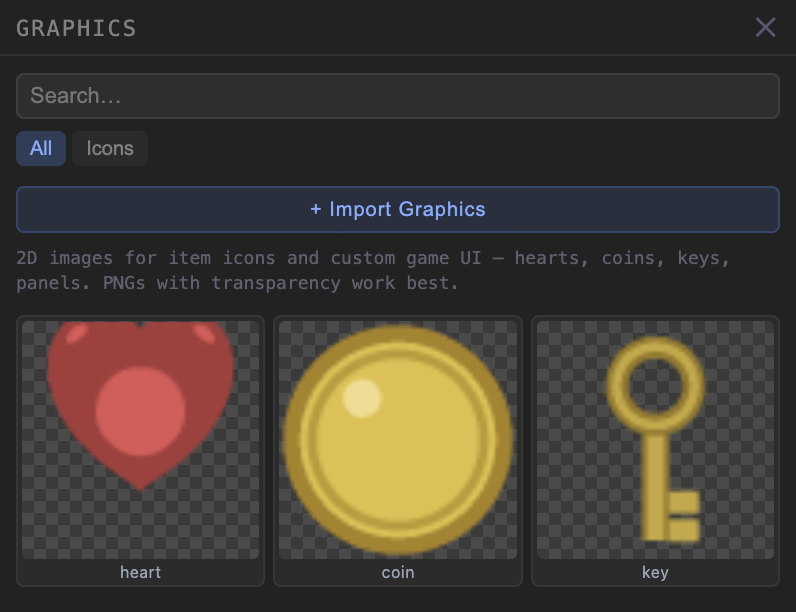
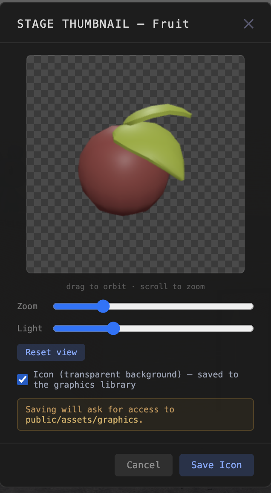
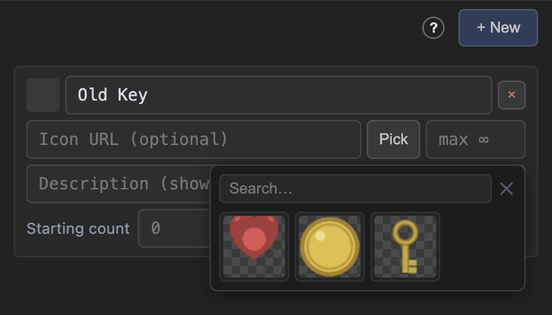
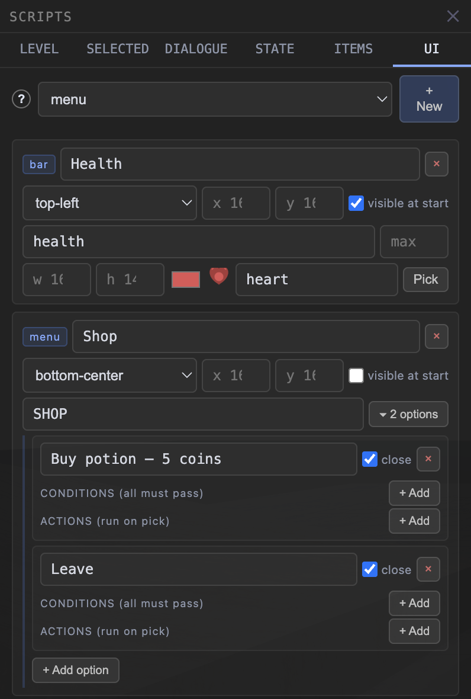
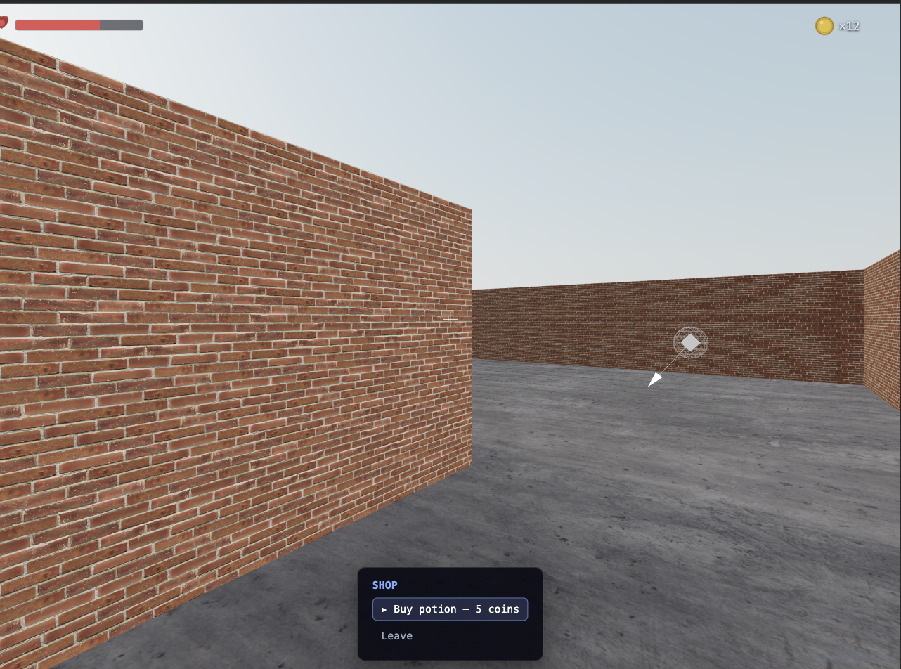

# Custom GUI & 2D Graphics — Authoring Guide

How to give your game its own on-screen UI — health bars, coin counters,
labels, splash images, and simple menus — and how to manage the 2D images
(icons, HUD art) they use. Written for humans clicking through the UI; the
JSON reference at the end is for hand-authoring or debugging. (Shipped in
Phases 48–49 / v4.43.0–v4.44.0 — the architecture doc has the engine-level
details.)

---

## The mental model

Two pieces, one for art and one for behavior:

- **The graphics library** (ASSETS → Graphics) holds flat images — PNGs with
  transparency work best. They're used as item icons and inside GUI elements.
  They are *not* 3D textures; think "sprite sheet folder".
- **The UI registry** (SCRIPTS → UI tab) holds **UI elements** — each one a
  widget with a screen position. Elements start **hidden** unless you tick
  *visible at start*; scripts show and hide them with the `show_ui` /
  `hide_ui` actions.

```
  GRAPHICS LIBRARY            UI ELEMENTS (SCRIPTS → UI)         IN GAME
  heart.png  coin.png   ──▶   bar "Health"  (heart, health key)  ──▶  ❤ ▓▓▓▓░░
  key.png    panel.png        counter "Coins" (coin, coins key)       🪙 ×12
                              menu "Shop" (options + actions)         [ SHOP ]
```

The important rule: **a bar or counter is bound to a state key** (the same
gameplay state the STATE tab manages — including item counts at `inv.<id>`).
You never "update the UI" from a script; you change the state
(`adjust_number coins +5`) and every bound widget updates by itself.

Visibility works the same way under the hood: showing an element sets a hidden
state key (`__ui.<id>`). That's why shown/hidden UI **survives scene
transitions**, is **saved and restored on Continue**, and **resets on New
Game** — it's just game state.

---

## The graphics library



Open **ASSETS → Graphics**. The editor ships with a small starter set (heart,
coin, key). **+ Import Graphics** copies your own images into
`public/assets/graphics/` and registers them:

- Pick **many files at once** — asset packs (e.g. Kenney's UI packs) import in
  one batch, with one shared category and one shared attribution block.
- `.png` (transparency supported), `.jpg`, `.webp`.
- Labels are editable per file before importing; the checkerboard in every
  preview shows exactly what's transparent.

**Manage** (beside Import) turns the tiles into checkboxes so you can clean up
the library: **Edit** changes label / category / attribution (works on a
multi-select too), **Delete** removes graphics from the library — with an
optional checkbox to also delete the image files from disk. If a graphic is
still used by an item icon or a UI element, the delete confirmation warns you
first; deleting anyway leaves those spots blank until you reassign them.

## Making an icon from a 3D model



Any imported model can become a 2D icon: **ASSETS → Models → Manage → check
one model → 📷**. Tick **"Icon (transparent background)"** — the preview
switches to a checkerboard, and you can orbit / zoom / light the shot exactly
like a thumbnail. **Save Icon** writes `<model>_icon.png` into the graphics
library (it never touches the model's own thumbnail). Great for inventory
icons of pickups that already exist as models.

## Item icons



In **SCRIPTS → ITEMS**, every item's icon field now has a **Pick** button that
browses the graphics library. Picking writes the image path into the field —
the field itself still accepts any URL if you prefer to type one. The icon
shows in the in-game bag (I / Tab).

---

## Building your HUD (SCRIPTS → UI)



Pick a kind in the dropdown, hit **+ New**, fill in the row:

| Kind | What it shows | The fields that matter |
|---|---|---|
| **bar** | A filled bar (health, stamina, progress) | *state key* (numeric), *max* (full-bar value, default 100), width/height, fill color, optional icon |
| **counter** | Icon + number (coins, keys, ammo) | *state key* — use `inv.<item>` for item counts (the state-key box suggests them), prefix (default ×), optional icon |
| **icons** | A row of repeated icons — hearts, stars — full / half / empty (GTA stars, Zelda hearts) | *state key* (numeric), *icons* (how many, default 3), *full at* (state value when all are full; blank = 1 per icon), a **Full** graphic, optional **Half** and **Empty** graphics |
| **label** | A line of text | text, font size, color |
| **image** | A picture (logo, frame, splash) | a graphic, width/height, opacity |
| **menu** | A titled list of clickable options | title + options (below) |

Every element also has:

- **anchor** — which screen corner/edge it sticks to (top-left, top-center,
  top-right, bottom-left, bottom-center, bottom-right) plus x/y pixel offsets.
- **visible at start** — shown without any script. Leave it off for menus and
  popups you'll open with `show_ui`.
- **backdrop** — a translucent grey rounded box behind the element, for
  contrast when the HUD sits over a bright sky (a white counter on a white sky
  is unreadable without it). Available on every kind except menus, which have
  their own box.

### Menus

Expand a menu's **options**. Each option has:

- **text** — what the player reads.
- **conditions** — all must pass or the option is hidden (same conditions as
  scripts and dialogue options: `has_state`, `compare_number`, `has_item`).
  Conditions re-check live — an option can appear the moment a flag is set.
- **actions** — run when picked, through the real script engine: `set_state`,
  `give_item` / `take_item`, `play_sound`, `show_dialogue`, `load_scene`,
  even `show_ui` for a submenu.
- **close** — ticked (default) the menu hides itself after the pick; untick
  for shop-style menus that stay open.

Players drive menus with the same inputs as dialogue: arrows / d-pad to move
the highlight, E / Enter / gamepad A to pick, mouse click and hover also work.
While a menu is open the player stops walking (menu mode), and if a dialogue
is open at the same time, the dialogue wins the confirm button.

### Showing and hiding from scripts

Two actions, anywhere scripts run (level scripts, triggers, dialogue options,
menu options):

- **`show_ui`** — pick the element from the dropdown.
- **`hide_ui`** — same, in reverse.

A typical shop: an NPC's `on_interact` script runs `show_ui → Shop`; the
shop's "Leave" option just closes itself (the *close* tick). A typical HUD:
tick *visible at start* on the bar and counter and never think about them
again.

What persists: shown/hidden state survives scene changes and lives in the
save file (Continue restores it); New Game resets everything to *visible at
start*.

### The result



---

## Project vs scene scope

With a project open, the UI tab edits the **shared game.json registry** — the
same elements exist in every scene (written to disk on Save). Without a
project, elements live in the scene file. If both define the same element id,
the scene's version wins (items work the same way).

---

## JSON reference

`GraphicDef` — one entry in `public/assets/graphics/manifest.json`:

```jsonc
{ "id": "heart", "label": "heart", "category": "Icons",
  "path": "/assets/graphics/heart.png", "width": 64, "height": 64 }
```

`UiElementDef` — one entry in `game.json`'s or the scene's `uiElements` array.
Common fields: `id` (`ui_<uuid8>`), `label`, `anchor`, `offsetX`/`offsetY`
(px, default 16), `startVisible`, `backdrop` (contrast pill; menus ignore it).
Per kind:

```jsonc
{ "kind": "bar",     "stateKey": "health", "max": 100,
  "width": 160, "height": 14, "color": "#e05555", "graphicId": "heart" }

{ "kind": "counter", "stateKey": "inv.itm_a1b2c3d4",
  "graphicId": "coin", "prefix": "×", "size": 24 }

{ "kind": "icons",   "stateKey": "Hearts", "count": 3,
  "fullGraphicId": "heart_icon", "halfGraphicId": "heart_half_icon",
  "emptyGraphicId": "heart_outline_icon", "size": 24 }
// count icons, 1 state unit each (set "max" to rescale, e.g. 100 HP over 5 hearts).
// With a half graphic the value rounds to the nearest half; without, to the
// nearest whole. No empty graphic = the full one at 25% opacity.

{ "kind": "label",   "text": "Find the key", "fontSize": 13, "color": "#dde3f0" }

{ "kind": "image",   "graphicId": "logo", "width": 128, "opacity": 0.9 }

{ "kind": "menu",    "title": "SHOP", "options": [
    { "id": "opt_x", "text": "Buy potion — 5 coins",
      "conditions": [{ "type": "has_item", "itemId": "itm_coin", "count": 5 }],
      "actions":    [{ "type": "take_item", "itemId": "itm_coin", "count": 5 },
                     { "type": "give_item", "itemId": "itm_potion" }],
      "closeOnPick": false }
] }
```

Runtime state: element visibility is gameplay-state key `__ui.<elementId>`
(true/false; unset = the element's `startVisible`). The `__` prefix keeps
these out of the STATE tab's live values.

## Current limits (v1)

- One menu is keyboard/gamepad-navigable at a time (the first visible one);
  extra visible menus still take mouse clicks.
- Bars/counters format numbers plainly (no 1.2k abbreviations, no animations
  beyond the bar's fill transition).
- No drag-to-position editor — placement is anchor + offsets. In editor
  preview the overlay spans the whole window (panels included); in the
  published runtime it spans the game view exactly.
- Styling is deliberately simple: panel/menu looks match the built-in
  dialogue boxes. Custom fonts/skins are a later increment.
