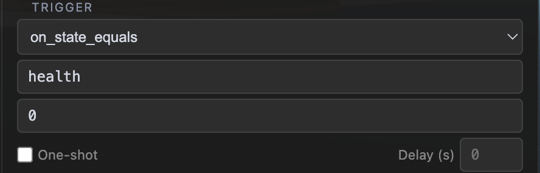
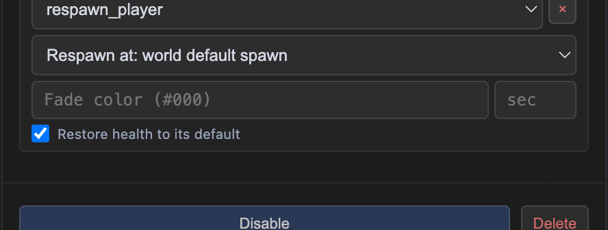
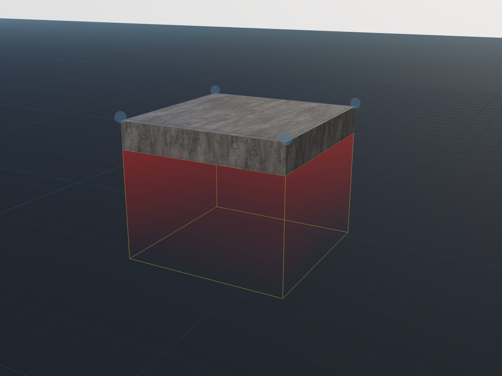
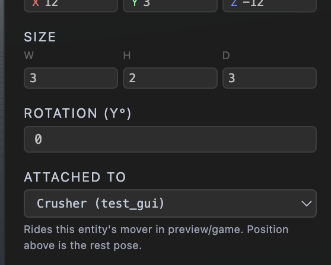
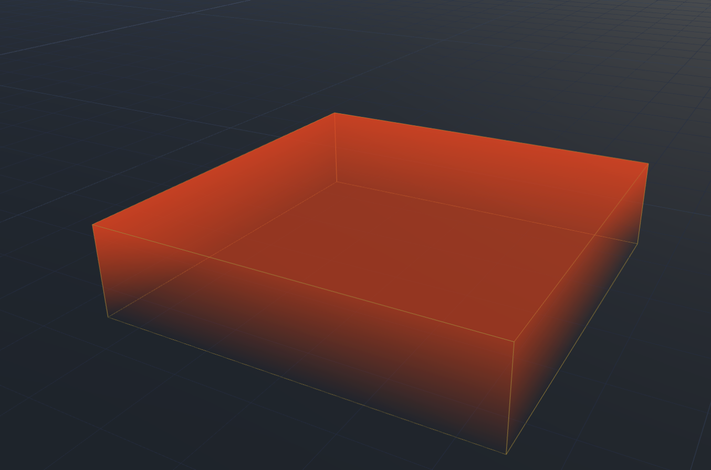
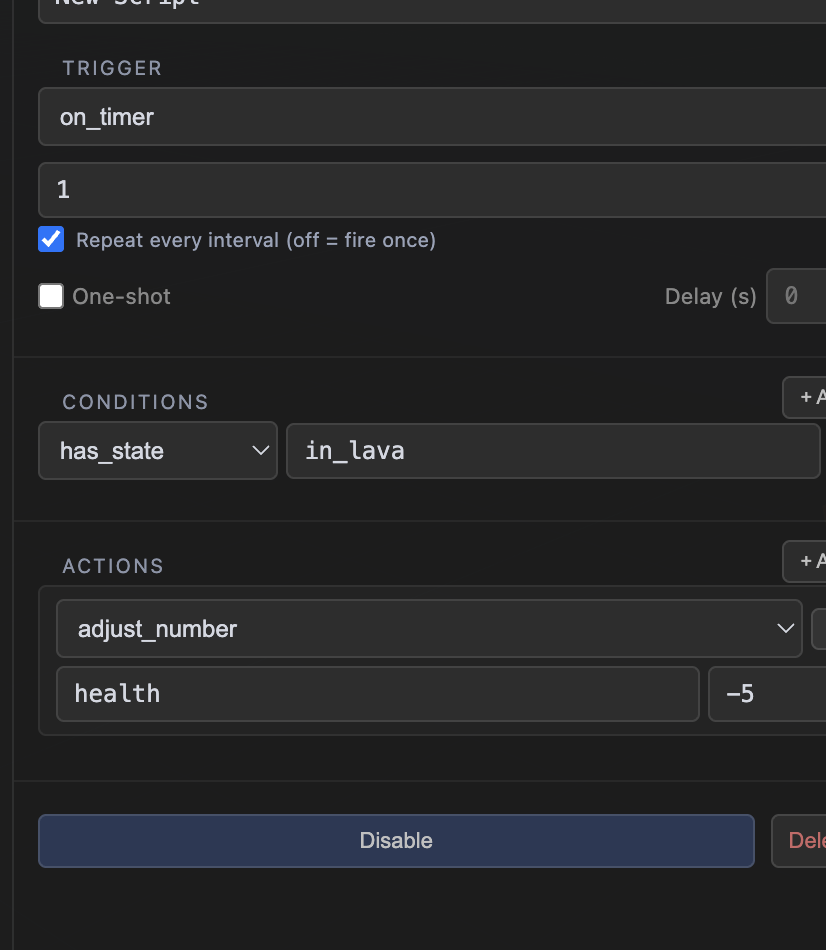

# Hazards, Death & Respawn — a builder's guide

How to hurt the player, and what happens when you succeed. Everything here
ships as of Phase 53+: the `on_state_equals` trigger, the `respawn_player`
action, checkpoint markers, and trigger volumes that can **attach to moving
things**. If you already built kill floors by hand out of `store_position` +
`teleport_player`, they still work — this guide shows the shorter road.

> Companion reading: `STATE_ITEMS_GUIDE.md` (what state keys are),
> `GAMEPLAY_STATE.md` (the machinery underneath).

---

## The pieces, at a glance

| Piece | Where it lives | What it does |
|---|---|---|
| **Health** | built-in state key (SCRIPTS → STATE tab) | starts at 100, clamped 0–100 unless you change its schema |
| **Checkpoint marker** | Spawn tool → **+ Checkpoint** mode | an inert, named position+facing flag — does nothing until a script references it |
| **Trigger volume** | Trigger tool | invisible region — box, sphere, cylinder, or capsule (SHAPE in its panel); fires `on_player_enter` / `on_player_exit` scripts |
| **`respawn_player`** | script action | the whole death sequence: fade out → teleport → optional health refill → fade in |
| **`store_position`** | script action | saves a pose (position + facing) into a state key |

Every recipe below is some arrangement of these five.

---

## Checkpoints and respawn — the full wiring

This is the part most games want first, so here it is end to end. There are
two working patterns; pick by how many checkpoints you have.

### Step 1 — place a checkpoint marker

Open the **Spawn** tool in the left toolbar. It has two modes at the top of
its panel: **◉ Initial Spawn** (the world's default spawn — every world has
exactly one) and **+ Checkpoint** (drop as many markers as you like). Switch
to Checkpoint mode and click where respawns should land. Select a marker to
give it a **label** ("Checkpoint 1") — labels are what you'll see in every
dropdown later, so name them.

A marker by itself does *nothing*. It's a bookmark, not a sensor: nothing
happens when the player walks past one. Making it "count" is Step 2.

### Step 2 — activate it with a trigger volume

Drag a trigger volume across the doorway/ledge the player crosses at that
point in the level, and give the volume this script:

- **Trigger:** `on_player_enter`
- **Action:** `store_position` — source **object position**, pick your
  checkpoint marker, state key `checkpoint`

The entity dropdown groups **Checkpoints first** (platform-kit tiles and
other prefab internals are filtered out entirely), so your marker is at the
top. When the player crosses the volume, the marker's position *and facing*
are saved into the `checkpoint` state key. A later volume doing the same
overwrites it — **most-recent checkpoint wins automatically.**

> **The state key must match — exactly.** `store_position` writes to whatever
> key you type, and `respawn_player` reads from whatever key *it* has typed.
> `checkpoint` vs `Checkpoint` vs a stray-keystroke `checkpointdsa` are three
> different keys, and a respawn reading an unset key doesn't error — it
> **silently falls through to the default spawn** (see the destination order
> below). If deaths keep sending you to the level start, check spelling on
> both ends first. The key inputs autocomplete known state keys — picking
> from the suggestion list beats retyping.

You can also skip the marker and store the **player's own position**
(`store_position` → source: player position). That respawns the player at
the exact spot they touched the volume — fine for wide-open areas, riskier
near ledges (they might have clipped the volume mid-jump). Markers give you
a curated, safe landing spot; that's why they exist.

### Step 3 — respawn there on death

Wherever death is handled (kill floor script or central death handler — next
section), use **`respawn_player`**. Its destination dropdown has three modes:

- **Stored position key** — reads a pose from a state key (your `checkpoint`
  key from Step 2). Use this whenever you have **more than one** checkpoint:
  the key always holds the latest one.
- **A checkpoint** — pick one specific marker from a dropdown. Simplest
  possible wiring for a **single**-checkpoint level; no state key involved.
  (If this dropdown ever did nothing for you: that was a real bug, fixed —
  selecting the mode used to instantly snap back to "world default spawn".)
- **World default spawn** — the fallback that always exists.

At runtime the action tries them in order — **stored key → picked checkpoint
→ default spawn** — using each only if the previous one came up empty. That
fall-through is deliberate and is why dying *before* the first checkpoint
doesn't strand you: an empty `checkpoint` key just drops to the default
spawn. It also means you don't need an `on_game_start` seeding script,
though storing the player's spawn pose there is harmless if you want one.

The full sequence when the action runs: fade to a color (default black,
0.4s) → **while the screen is covered** teleport the player (facing
included, fall speed zeroed) → optionally restore health → fade back in.

> Check **Restore health to its default** on the action — otherwise the
> player respawns at 0 health and instantly dies again.

### Testing the loop

Enter preview, open SCRIPTS → **STATE** — it shows live key values while
playing. Cross your checkpoint volume and watch the `checkpoint` key appear
with an `{x, y, z, facing}` pose. Then jump in the pit: you should fade out,
land at the marker, and see `health` back at its default. If you land at the
level start instead, the respawn read an empty destination — key typo'd on
one end, or the checkpoint volume never fired. Two ways a volume silently
misses:

- **It floats above the player's head.** A volume's POSITION Y is its
  **bottom face**, and the player is only about a meter tall — a volume
  whose wireframe doesn't touch the ground can pass clean over them (a gate
  authored 1m up missed by 3cm in practice). Drag it down until the
  wireframe meets the floor; the extra height above hurts nothing.
- **It's too short to catch a fall.** A fast-falling player can pass a thin
  box between frames — make pit volumes a few meters tall.

---

## The one script every game wants: a central death handler

Hazards multiply — floors, crushers, enemies, poison. Give every hazard one
job — *subtract health* — and put death itself in a single level script
(SCRIPTS panel → LEVEL tab), so there's exactly one place that decides what
dying means:

- **Trigger:** `on_state_equals`, state key `health`, equals value `0`
- **Action:** `respawn_player` (destination per the section above, and
  **Restore health** checked)

The trigger editor for it looks like this — the key and the value to match
are its only two fields:

And the action, with destination, fade, and the health-restore checkbox in
one place:

`on_state_equals` fires when the key **becomes** that value — not every frame
it stays there. Taking more hits while already at 0 does nothing (health is
clamped and unchanged values never re-fire), and after a respawn restores
health, reaching 0 again fires it again. Exactly the rhythm a death handler
wants. (`on_health_zero` in the trigger list is shorthand for this exact
health case — same behavior, no fields to fill.)

## Recipe: the kill floor

1. Trigger tool → drag a volume across the pit, tall enough to catch a fall
   (a fast-falling player can tunnel past a thin one between frames — a few
   meters tall is cheap insurance).
2. On the volume, add an `on_player_enter` script with one action:
   `set_state health = 0` (or `adjust_number health -100`).
3. The central death handler does the rest.

That's the whole thing. The volume never teleports anyone itself — it just
kills, and death is handled in one place no matter what caused it.

**The direct variant:** if your game has no health mechanic at all (classic
obby rules — touch the bad thing, restart), skip the death handler and put
`respawn_player` straight on the volume's enter script. Same destination
rules apply. The health route earns its extra script the moment *anything*
does partial damage, because every hazard then funnels into one death.

## Recipe: the crusher (a trigger that RIDES a moving platform)

The finished build — a mover platform with a red kill-glow volume attached
under it, descending onto the walkway:

1. Build the crusher block (a platform with a **mover** — e.g. slide on Y,
   distance 4, loop).
2. Trigger tool → drag a volume covering the space *under* the block's rest
   position.
3. Select the volume → **ATTACHED TO** (in the volume's properties panel,
   below ROTATION) → pick the platform:

4. Give the volume the same `on_player_enter → set_state health = 0` script
   as a kill floor.

The volume's sensor — and its wireframe and gradient glow, if you enabled the
Visual section — now ride the platform's motion in preview and game. The
trigger system checks overlap every frame regardless of who moved, so **the
volume descending onto a standing player fires exactly like a player walking
into a parked one.** That's the crush.

Worth knowing:

- The POSITION on the panel stays the volume's **rest pose** (where it sits
  before the mover runs). Move/resize it exactly like any volume.
- Anything mover-enabled can be a host: platforms, shapes, and placed
  objects. If the host is deleted or its mover is turned off, the volume
  quietly falls back to a normal static trigger at its authored spot.
- Copy a host and its attached volume together and the copy stays attached to
  the copied host. Same for prefabs.

## Recipe: the enemy sight-cone

For a placed **object** (an enemy model), you don't even need a trigger
volume: add a second collider to the object (Colliders screen), size it as
the vision box in front, tick **Sensor**, and put `on_player_enter` /
`on_player_exit` scripts on the object. Sensors on an object always follow
its mover — position *and* rotation — so a patrolling enemy's cone sweeps
with it. (A sensor is shape overlap, not line-of-sight: it sees through
walls.)

Use an attached trigger volume instead when the moving thing is a platform or
shape, or when you want the visible gradient glow.

## Recipe: damage over hazards, not instant death

Spikes that hurt but don't kill: `on_player_enter → adjust_number health -25`.
The UI bar (SCRIPTS → UI tab, bar bound to `health`) shows it dropping, and
the same central death handler fires only when it actually reaches 0. This is
the payoff of routing everything through health: floors, crushers, enemies
and poison all *stack* into one death.

## Recipe: the lava pool (damage over time)

Lava shouldn't kill on touch — it should *cook* you: lose health every second
you stand in it, escape if you're quick, die if you're not. Three small
scripts make that, and the pattern generalizes to poison gas, freezing water,
or any "hurts while you're inside" zone.

The finished pool — a shallow volume with the orange gradient fill so it
reads as lava in-game:

1. Trigger tool → drag a shallow volume over the lava area. Turn on the
   **Visual** gradient (orange, fade down).
2. **Two flag scripts on the volume** (its ENTRY/EXIT SCRIPTS list):
   - `on_player_enter` → `set_state in_lava = true`
   - `on_player_exit` → `set_state in_lava = false`
3. **One ticking script at the level scope** (SCRIPTS panel → LEVEL tab):
   - Trigger `on_timer`, interval `1`, **Repeat every interval** checked
   - Condition `has_state in_lava`
   - Action `adjust_number health -5`

The ticking script, assembled — repeat-timer trigger, the `in_lava` gate,
and the drain:

How the pieces behave together:

- The timer ticks every second for the whole session, but the **condition is
  re-checked on every tick** — it only actually drains while the flag is up.
  Step out and the drain stops instantly; the flag scripts are edge-triggered
  (enter/exit fire once per crossing, and re-setting a state key to the value
  it already has is a no-op), so nothing spams.
- When the drain reaches 0, your central death handler (`on_health_zero` →
  `respawn_player` with **Restore health** checked) takes over. The respawn
  teleports the player *out* of the lava, which fires the volume's exit
  script, which clears `in_lava` — so the drain doesn't follow them home.
- At −5 per second from 100 health, that's a forgiving 20 seconds; tune the
  delta and interval for how deadly the lava should feel. A second bigger
  penalty on the enter script (`adjust_number health -20`) makes touching it
  sting immediately, with the drain continuing after.

Variations on the same skeleton: **poison that lingers** — don't clear the
flag on exit; clear it at a healing fountain instead (`set_state in_lava =
false` on the fountain's enter script). **Regen** — a second repeat timer
with `adjust_number health +2`, conditioned however you like (or
unconditioned, so lava and regen fight each other and shallow dips heal
back). **Slow-kill crusher** — put the enter/exit flag scripts on an
*attached* volume so the drain zone moves with the machine.

## Recipe: a real enemy (Phase 61 — enemy AI)

Enemies that *chase* stopped being a trigger-volume trick: select a placed
object → **Enemy AI screen** → Enable. It notices the player inside DETECT
RADIUS (horizontal, max ~3m height difference), chases with some circling
(MOVEMENT VARIATION — 0 is a beeline), and bites in ATTACK RANGE: the attack
clip plays and, at DAMAGE MOMENT seconds into the swing, ATTACK DAMAGE is
subtracted from the global **DAMAGE KEY** (set it to your health key — this
game uses `Hearts`). It gives up beyond the GIVE-UP radius or its LEASH and
walks back to its post. No pathfinding: it stops at walls and refuses ledges,
so it patrols its own platform.

Hook effects with three triggers on the enemy's own scripts:
`on_player_detected` (alert bark, music sting), `on_player_lost`, and
`on_enemy_attack` (fires when a bite LANDS — add `flash_player` +
`launch_player` for hit juice; "★ this object" works inside all three).

- **Killable enemy**: give it its own STATE (`health`, Phase 60), hurt it
  with your stomp/sword volumes (`adjust_number` on ★ this object), and a
  script `on_state_equals` ★ this object `health == 0` → `despawn_object`
  ★ this object. Dead enemies stay dead across Continue; the AI goes dormant
  while despawned.
- **Stomp zones ride**: a trigger volume `attachTo` the enemy follows it
  while it chases (the crab's stomp zone does exactly this).
- **Goomba rule** — add the `player_falling` condition to the stomp script
  so it only counts when the player LANDS on it: walking into the zone and
  rising jumps fail; only airborne-and-descending passes (plus a short
  landing grace for edge cases). Without it, a short enemy can be killed by
  walking over it. **Make the zone extend ~0.3–0.5m ABOVE the enemy's back**
  — a zone flush with the back only registers razor-perfect landings, and
  against a moving enemy real jumps miss; a taller zone catches the descent
  mid-air. It's safe to make tall precisely BECAUSE the falling gate blocks
  grounded walk-ins. Conditioned enter-scripts are **occupancy-aware**: if
  the condition fails when you enter (e.g. you jumped from INSIDE the zone,
  entering while rising), it keeps watching and fires the moment the
  condition passes — so jumping on an enemy from point-blank works. Bites
  also whiff while you're on top of an enemy — its lunge only reaches
  forward.
- Clips auto-match by name (idle/walk/run/attack/bite) or pick them in the
  panel. The living example is the crab in platfrom-obby's level_1.

## The fine print

- **Stored poses are foot-level.** `store_position` saves where the feet are
  (markers sit at floor level too), and teleports land the feet on that
  point — so a pose stored on a platform respawns *standing on* it, not
  clipped into it.
- **A respawn destination that comes up empty falls through silently** —
  stored key unset (or typo'd) → picked checkpoint → default spawn. No
  error, no console spam. Great for "death before the first checkpoint",
  sneaky when the real cause is a misspelled key.
- `on_state_equals` works for any key, not just health — `coins == 10` →
  open the door, `boss_phase == 2` → change the music.
- It fires on the **transition** to the value. A key *starting* at the value
  (seeded by a STATE-tab default) doesn't fire it on load.
- `fade_screen` (the standalone action) releases the player when the fade
  ends — before Phase 53 it left input frozen forever. Scene transitions in
  published games also fade back in properly now.
- Exiting preview mid-death-sequence cancels the pending teleport and clears
  the overlay — nothing leaks into the editor.
- **Multi-scene games: clear the checkpoint key on arrival.** Game state
  deliberately survives scene transitions, but a stored pose is just raw
  coordinates — carried into the next scene, a respawn would land at those
  same numbers in the *new* scene. Add `delete_state checkpoint` to each
  scene's `on_level_load` script (checkpoint markers themselves are
  per-scene, so the picked-checkpoint and default-spawn modes are immune).
