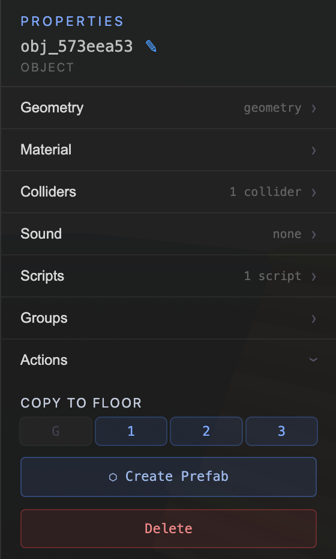
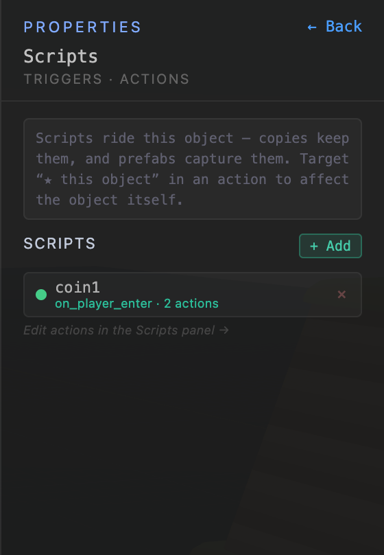
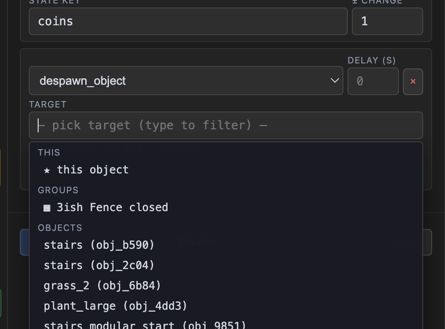
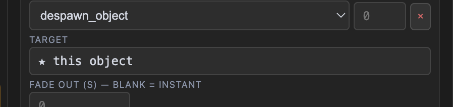

# Scripts That Ride Their Object — a builder's guide

Scripts used to *feel* global: they lived in the SCRIPTS panel, targets were
picked from one big list, and nothing about an object told you it carried any
behavior. As of v4.59, a script can genuinely belong to a thing — visible on
its properties panel, targeting *itself* without knowing its own id, and
riding along when the thing is duplicated or turned into a prefab. This guide
shows the pieces using the coin pickup from the demo obby.

> Companion reading: `PREFABS_GUIDE.md` (capturing things as prefabs),
> `HAZARDS_GUIDE.md` (trigger volumes + the death loop).

---

## Where an object's scripts live now

Select any placed object and its properties root has a **Scripts** row, with a
count — behavior is visible at a glance, next to Colliders and Sound:

Open it and you get the same list trigger volumes have always had in their
ENTRY/EXIT section: one row per script with its enabled dot (click to
disable without deleting), trigger type, action count, and a delete ×:

Two things to know about this screen:

- **+ Add picks a sensible trigger for you.** If the object is INTERACTABLE
  it presets `on_interact`; if it has a **Sensor collider** it presets
  `on_player_enter` (the coin above has one — that's how it detects the
  player); otherwise you get `on_game_start`. You can change the trigger
  afterwards, it's just a starting point.
- **Editing actions still happens in the SCRIPTS panel** (left toolbar →
  Scripts → SELECTED tab, or just click the script here and follow the
  pointer). This screen is the *what's attached* view; the panel is the
  editor.

The same idea in reverse: a script's **trigger is keyed to whatever entity
carries it**. You never type the object's id into the trigger — an
`on_player_enter` script on the coin fires when the player enters *that
coin's* sensor, automatically, even after the coin is copied.

## "★ this object" — self-targeting actions

Actions that affect entities (`despawn_object`, `play_animation`,
`change_material`, movers, doors…) need a target. When the script you're
editing is attached to an object or volume, the target picker now pins a
**This** group at the very top:

Pick it and the field reads back as the star option:

Here's the part that matters: **the script doesn't store the object's id — it
stores the literal word "self"**, which the engine resolves to *whatever
entity the script is riding on* every time a level loads. That's what makes
scripts portable:

- **Duplicate the coin** (Cmd+D) → the copy's script despawns *the copy*.
- **Make the coin a prefab** and stamp ten of them → each one's script
  despawns *itself*. No editing, no id hunting, ever.

If you'd picked the coin by id instead, every copy would despawn the
*original* coin. ★ this object is why you don't have to think about that.

## The coin pickup, end to end

The complete recipe — build once, stamp forever:

1. Place the coin object. Give it a **Sensor collider** sized generously
   (Colliders screen → tick Sensor) so walking near it counts as touching it.
2. Scripts screen → **+ Add** (presets `on_player_enter` because of the
   sensor). Open it in the SCRIPTS panel and add the actions:
   - `play_sound` → a pickup chime
   - `adjust_number` → state key `coins`, change `+1`
   - `despawn_object` → target **★ this object**, fade out `0.3`
3. Mark the script **One-shot** so a coin can't be collected twice.
4. Select the coin → **⬡ Create Prefab** → rename it in the Prefabs panel →
   Place as many as the level wants.

Every placed coin detects its own touch, bumps the shared `coins` counter
(state keys are global — one counter, many coins, which is what you want
here), and fades *itself* out. One-shot flags are tracked per placed copy,
so collecting one never blocks the others.

The chest works the same way with `on_interact` instead: INTERACTABLE on,
script with `play_animation Chest_Open (Hold)` + `give_item` +
`despawn_object → ★ this object` (delay 0.8, fade 1) — then Create Prefab.

## What got fixed underneath (why copies used to break)

If you tried this before v4.59 and it half-worked, these were the reasons —
both are gone:

- **A duplicated trigger volume's scripts fired on the original.** The
  volume's enter/exit script secretly stored the source volume's id in its
  trigger, and the copy kept it — so walking into the copy did nothing and
  walking into the original fired twice. Triggers are now always keyed to
  the entity that owns the script, whatever the stored data says.
- **Duplicated one-shot scripts shared one "already fired" flag.** Script
  ids were copied verbatim, and one-shot tracking (which persists into game
  saves) is by script id — so collecting coin A marked coin B as spent.
  Copies now get fresh script ids.

## The editor, since v4.79.49 (cards)

A script reads top to bottom:

- **The trigger card** — what fires the script, as a sentence ("every 2s",
  "when the player enters hurt spikes"), with its settings as chips: click
  *timer repeats every 2s* / *runs each time it fires* to toggle them; click
  *no delay*, ⋯, or the title for the full trigger form. The script's name is
  the editable title above the card.
- **only when …** — script-level conditions as sentences; click one to edit
  it, *+ condition* adds one.
- **Action cards** — one per action: an icon for the family, the thing it acts
  on as the title (`SpikeTrap_Up`, `coin_pickup`, `hurt spikes › spikes-up`),
  the verb and parameters underneath. Click a card for its properties (one
  open at a time); ⋯ for wrap-in-if, move to a branch, duplicate, delete.
  The *+ action* / *+ if-block* dashed cards at the end add more.
- **If-blocks** are grouped cards — an amber IF strip with the condition
  sentence (click it to edit; *+ and* adds another), the branch's cards under
  it, ELSE IF / ELSE strips, and a footer for *+ else if*, *+ else*, *unwrap*
  (actions drop to the top level) and *delete block* (actions go too).

Every form is a list of property rows — label on the left, control on the
right — with switches for on/off settings and sliders for volumes and
seconds. Nothing about what scripts can do changed; only how they read.

## If-blocks — actions that share a condition, with else / else if

Actions in a script run in parallel, and any of them can sit inside an
**if-block** (v4.79.47). A block holds as many actions as you like under ONE
set of conditions, so "if spikes are up: play the sound AND hurt the player"
is one block, not the same guard written twice:

- **+ If** (next to + Add) starts an empty block; the **if** button on a
  top-level action wraps that action in a new block. **+ action here** adds
  into a branch; the **move to** picker on any action relocates it (top
  level, IF #1, ELSE IF #1.1, ELSE #1 …).
- **+ else if** adds another branch, checked only when the branches above
  failed; **+ else** adds the catch-all. The first passing branch wins — the
  others never run. **× branch** / **unwrap** never delete actions; they drop
  to the top level.
- Conditions inside a branch are the same rows as the script's own
  conditions: every type, "Whose state" scoping (★ this object, a specific
  entity, global), and the **unless** toggle that inverts one condition.
  A branch with no conditions always passes (the editor warns).
- A block is decided **once, when the script's actions start** — after the
  trigger's delay, before any action's own delay. Actions inside keep their
  per-action delays; the branch choice doesn't change if state flips while
  a delayed action is waiting. Script-level conditions still gate the whole
  script; blocks refine within it.

The older per-action **ONLY IF** guard (v4.79.37, checked after the action's
delay) is shown as a one-branch block when you open such a script and is
saved in the new shape on your first edit; unedited scripts keep running
exactly as before.

## The fine print

- **"self" only means something on an entity's own script.** In a zone-level
  script (SCRIPTS → LEVEL tab) or a dialogue effect there's no owner — a
  `self` target there does nothing and logs a console warning.
- The star reads "★ this volume" on trigger-volume scripts — same mechanics.
- Prefab members' scripts are captured with the prefab and re-stamped per
  instance; intra-prefab id references (say, the prefab's volume targeting
  the prefab's own chest by id) are remapped per instance too. `self` needs
  no remapping at all — that's the point of it.
- State keys in scripts are still **global and shared across copies**. For a
  counter (`coins`) that's exactly right. For per-copy flags (a dozen chests
  each remembering it was opened) prefer One-shot scripts — a persistent
  per-instance state system is a possible future feature.
