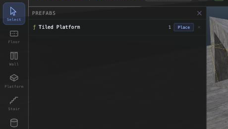
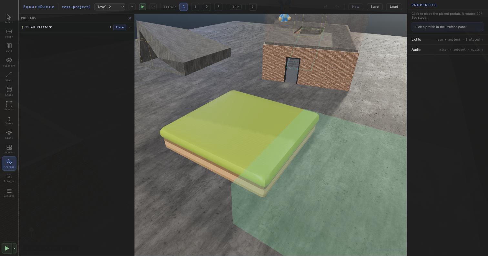
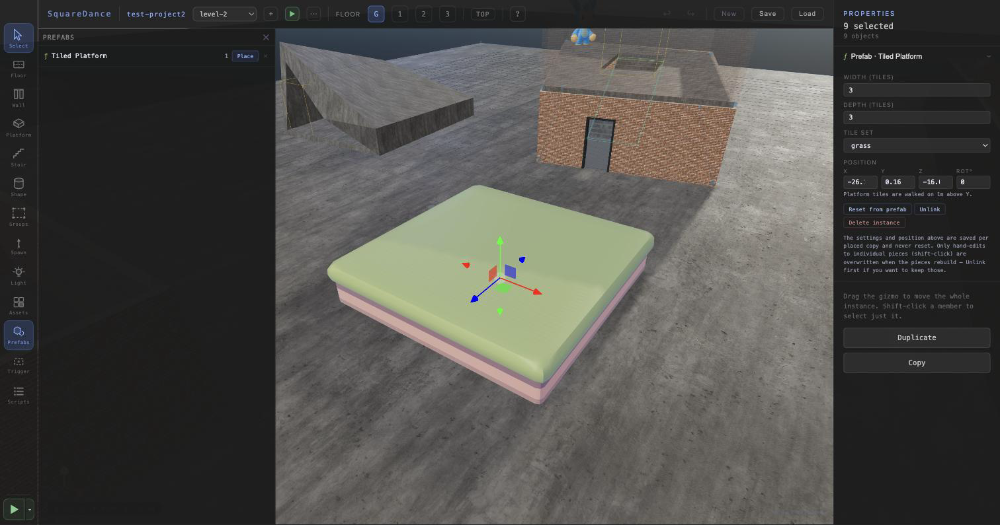
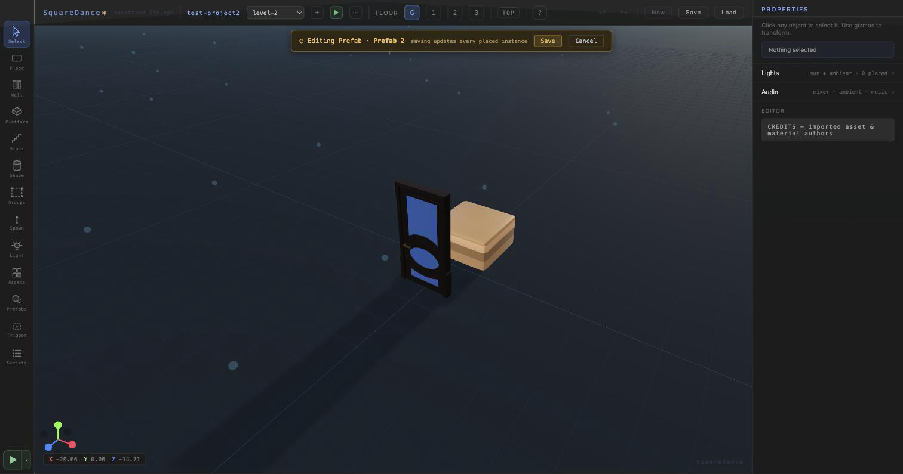

# Prefabs — Authoring Guide

How to create, place, configure, and edit reusable prefabs in the World Editor.
Written for humans clicking through the UI; the JSON reference at the end is for
hand-authoring or debugging. (Shipped across Phases 43–47 / v4.37.0–v4.42.x —
the architecture doc has the engine-level details.)

---

## The mental model

A **prefab** is a reusable recipe for a group of world things — objects,
triggers, scripts — that you place as many times as you like. Every placed copy
(an **instance**) stays **linked** to the recipe: change the recipe and every
copy updates. Each copy also keeps its **own settings** (like a platform's
width) and its own position.

```
  PREFAB (the recipe)                INSTANCES (placed copies)
  ┌─────────────────────┐            ┌─────────────┐  ┌─────────────┐
  │ Tiled Platform      │  ──place─▶ │ 4×3, grass  │  │ 6×6, dirt   │
  │ width / depth /     │            │ at (-26,-16)│  │ at (10, 40) │
  │ tileSet parameters  │  ◀─linked─ │             │  │             │
  └─────────────────────┘            └─────────────┘  └─────────────┘
```

Two kinds of prefab:

| Kind | Where it comes from | What it contains |
|---|---|---|
| **Generator** (ƒ) | Built into the editor (currently: **Tiled Platform**) | Code that builds pieces from parameters — width/depth/tile-set in, a grid of kit tiles out. |
| **Snapshot** (⬡) | **You**, by capturing a selection | A frozen copy of the entities you selected — models, trigger volumes, shapes, stairs, ladders, with their scripts. The door case: model + trigger + open script, captured once, placed everywhere. |

Under the hood an instance is real entities plus a small link record — the
runtime plays scenes with zero prefab machinery, and deleting a prefab never
breaks the worlds that used it (see **Orphans** below).

---

## Creating



**A generator prefab** — open the **Prefabs** toolbar panel. Built-in
generators are always listed; the first time you hit **Place** on one, it
becomes a library entry (stored in your project's `game.json` immediately).

**A snapshot prefab** — build the thing once in the world (say a door model,
a trigger volume around it, and an `on_player_enter` script on the volume that
targets the door). Multi-select all its parts — shift-click, or put them in a
group and use the Groups panel's **Select** — then press **⬡ Create Prefab**
in the properties panel. The selection is captured as the template and replaced,
in place, by the prefab's first linked instance (one undo step). Rename it in
the Prefabs panel.

What can be captured: objects, trigger volumes, shapes, stairs, ladders.
Walls, floors, and platforms are skipped (they're corner-node-based; a console
warning lists anything skipped).

**Script gotcha:** scripts inside a captured prefab are re-targeted per
instance — each placed door's trigger opens *its own* door. But literal
**coordinates** inside actions (a `move_object` position) are captured verbatim
and NOT shifted per instance. Prefer relative/targeted actions (`open_door`,
`play_animation`, `despawn_object`) in prefab scripts.

## Placing



Prefabs panel → **Place** → click in the viewport. The green ghost box shows
the footprint; **R** rotates 90°, **Esc** stops, and placement stays armed for
repeated clicks. For platform tiles, the walkable top sits **1m above** where
you click.

## Selecting & configuring an instance

Click any piece of a placed instance and the **whole instance** selects — one
gizmo moves it all, and the properties panel shows the **Prefab section**:



- **Settings** (generator parameters like width/depth/tile-set): per-instance,
  applied live as you type (short debounce) or step the arrows. These are
  *yours per copy* and **never reset** — not by prefab edits, not by Reset.
- **Position** (X/Y/Z/ROT°): moves the whole instance; equivalent to dragging
  the gizmo.
- **Reset from prefab**: rebuilds every piece from the recipe. Settings and
  position are kept; the only thing it discards is hand-edits to individual
  pieces. If you never shift-click into an instance's guts, it's a no-op.
- **Unlink**: detaches the pieces into plain, independent entities. Prefab
  updates stop affecting them forever. Do this when you want a one-off you can
  sculpt freely.
- **Delete instance**: removes every piece and the link.

**Shift-click** a piece to select *just it* — the escape hatch for tweaking a
single piece. Know the rule: piece-level tweaks are **not** part of the recipe
or the instance's settings, so they're overwritten the next time the pieces
rebuild (any settings change, prefab edit, or Reset). Unlink first if you want
piece tweaks to stick. Copy/paste/duplicate of pieces always produces unlinked
copies.

## Editing a prefab (snapshot prefabs)

Prefabs panel → **Edit** (amber, snapshot prefabs only — a generator's
parameters *are* its interface). The world temporarily disappears and the
prefab's pieces appear alone at the origin. Use all the normal tools: move
things, add objects, edit scripts, delete pieces.



- **Save** (amber top bar): the recipe updates and **every placed instance in
  the scene rebuilds to match** — one undo step. Other scenes in the project
  catch up when next opened.
- **Cancel**: discards the editing session; nothing changes.

While editing: project save, scene switching, and Play are disabled, and the
autosave is suspended (the editing sandbox can never leak into your world).
Heads-up: the world's undo history is cleared when entering and leaving edit
mode.

## Where prefabs live

- **Project open**: in the project's `game.json`, written **immediately** on
  every create/rename/edit (like model imports) — shared by all the project's
  scenes.
- **No project**: in a browser-local session library, automatically promoted
  into `game.json` the next time you open a project.

Instances themselves live in the scene file as ordinary entities plus a small
`prefabInstances` record per zone — scenes are always playable stand-alone.

## Orphans (⚠ definition missing)

If an instance's prefab definition is gone (deleted, or created before
definitions were written immediately), the instance keeps working — its pieces
are real entities. Selecting it shows a **⚠ definition missing** panel with the
operations that still make sense: **Unlink** or **Delete instance**.
Generator instances are better than that: they **auto-heal on scene load** —
the editor re-infers the generator from the instance's settings and relinks
(recreating the library entry if needed).

## Kit-tile fine print (Tiled Platform)

The platformer-kit tiles are **hollow, double-sided shells** (grass lid + dirt
skirt, no bottom or interior), and interior tiles are a flat sheet. Flush, a
platform looks solid. If you pull a piece out (or float the platform and look
up at it), you'll see into the hollows — which reads as weird melted/draped
geometry. That's the asset pack, not a bug. Collision is a solid slab with the
walkable top at origin+1m regardless.

---

## JSON reference (debugging / hand-authoring)

**Library** (`game.json`):

```jsonc
{ "prefabs": [{
    "id": "pfb_5a31a5da",
    "name": "Tiled Platform",
    "kind": "generator",            // or "snapshot"
    "version": 3,                    // ++ on every template/default edit
    "generatorId": "tiled-platform", // generator only
    "variables": [ { "name": "width", "type": "number", "default": 3, "min": 2, "max": 32, "step": 1 }, … ],
    "template": [ … ]                // snapshot only: [{ memberKey, type, def }] in prefab-local space
}]}
```

**Per-zone instance record** (scene file, `zone.prefabInstances`):

```jsonc
{ "id": "pfi_f65c07d1", "prefabId": "pfb_5a31a5da",
  "version": 3,                                  // recipe version last built against
  "variables": { "width": 4, "depth": 3, "tileSet": "grass" },
  "origin": { "position": { "x": -26, "y": 0, "z": -16.5 }, "rotationY": 0 } }
```

**Per-piece stamp** (on each member entity):

```jsonc
{ "prefab": { "prefabId": "pfb_…", "instanceId": "pfi_…", "memberKey": "tile_1_2" } }
```

`memberKey` is the piece's stable role — rebuilds match pieces by it, which is
why surviving pieces keep their entity ids (and external script references to
them keep working) across width changes and prefab edits. Scenes whose records
carry an older `version` than the library's rebuild automatically at load.

Engine details (expansion pipeline, edit-mode staging zone, undo journal
wiring): `WORLD_EDITOR_ARCHITECTURE.md` changelog v4.37.0–v4.42.x and
`plans/phase-43…47-*.md`.
