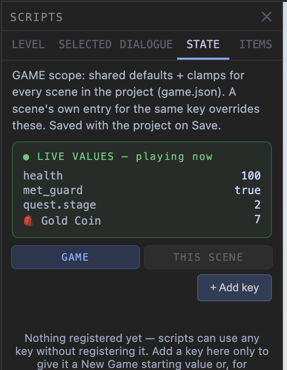
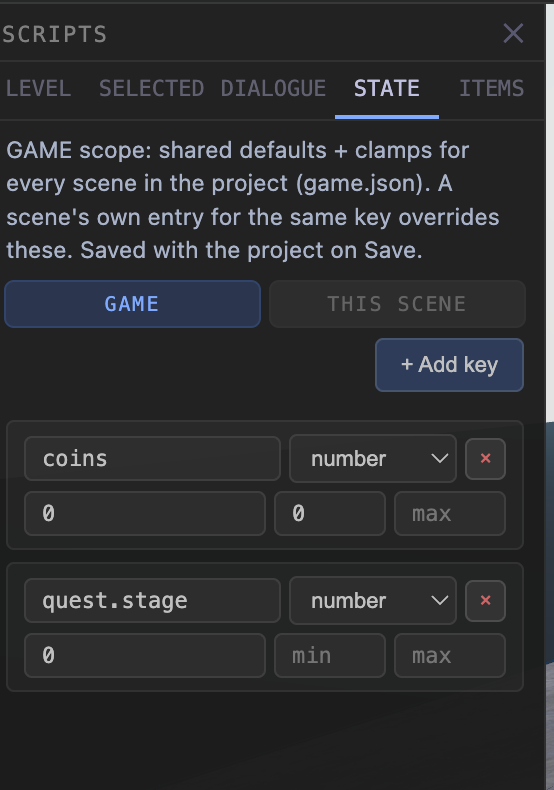
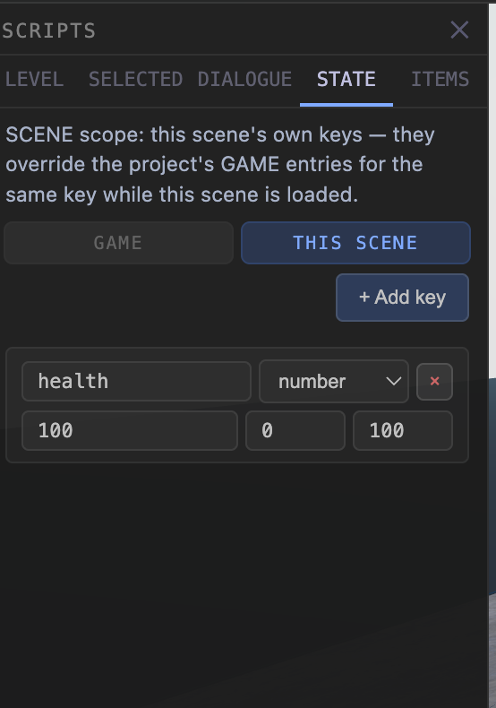
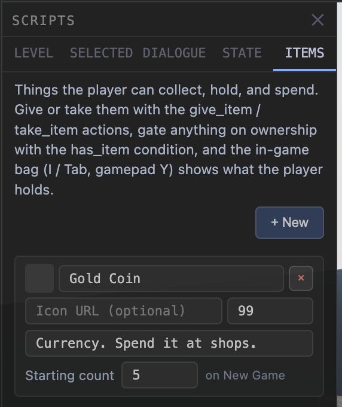
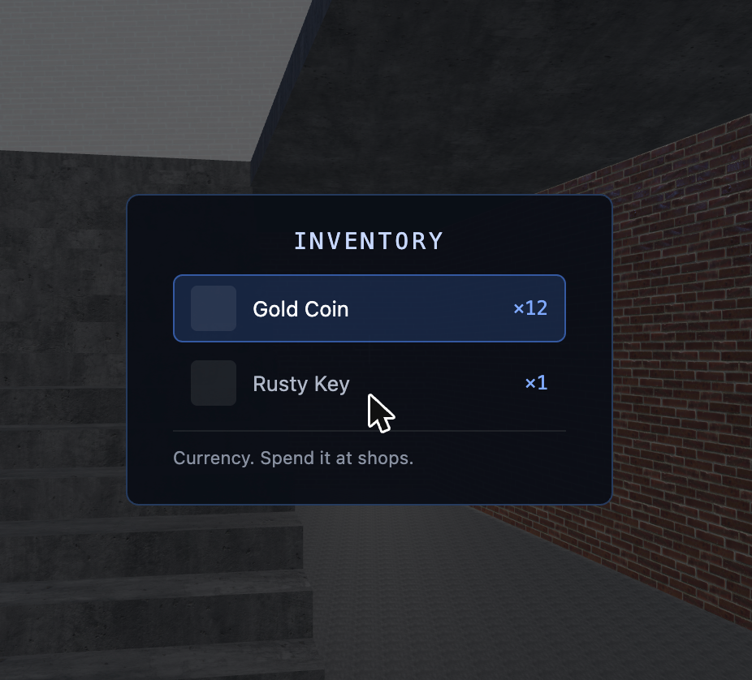
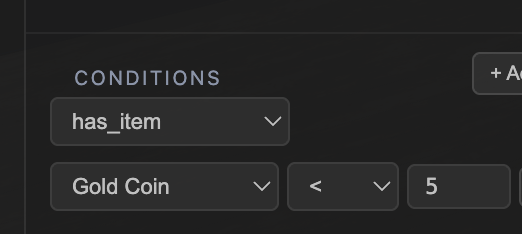

# State, Schema & Items — the "what do these tabs mean" guide

This guide explains the three related-but-different systems behind the
SCRIPTS panel's **STATE** and **ITEMS** tabs: what each one is *for*, how they
differ, and step-by-step recipes. If dialogue is what you're after, see
`DIALOGUES.md`; this guide is about the data those dialogues (and scripts,
portals, and the bag) read and write.

**Where everything in this guide lives:** left edge toolbar → **SCRIPTS**
button (bottom of the strip) → the panel with five tabs:
`LEVEL · SELECTED · DIALOGUE · STATE · ITEMS`.

---

## The 30-second mental model

There are **three layers**, and each tab/action touches exactly one:

| Layer | What it is | Where you touch it |
|---|---|---|
| **1. State values** | The game's live variables — one big global pool of `key = value` (`coins = 12`, `met_npc = true`). This is what actually changes while playing. | Script **actions** (`set_state`, `adjust_number`, `give_item`…) and **conditions** (`has_state`, `compare_number`, `has_item`) |
| **2. Schema** | *Configuration about* those variables: a starting value ("default") and, for numbers, min/max limits ("clamps"). Registering a key here doesn't create a feature — it just gives an existing key rules. | **STATE tab** |
| **3. Items** | An *identity layer* on top of state: a registry that gives certain counters a name, icon, description, and stack size — so scripts get dropdowns instead of typed keys, and the player gets a bag. | **ITEMS tab** |

Two rules carry most of the understanding:

1. **Values are always global.** There is no per-scene variable pool. Set
   `coins` in Level 1 and it *is* `coins` in Level 2 — that's what makes keys
   found in one level open doors in another. (Want scene-flavored keys? Use a
   naming convention like `l2.door_open` — it's still global, just namespaced
   by you.)
2. **You never have to register anything.** A script can `set_state
   secret_found = true` and a condition can check it without the key
   appearing anywhere in the STATE tab. Registering adds *only* a New Game
   default and (numbers) clamping. Unregistered keys default to "absent".

---

## Layer 1 — State values (the variables themselves)

You don't edit values in a panel; **scripts and dialogue create them by
writing them**. The vocabulary:

**Writing:**

| Action | Effect |
|---|---|
| `set_state`     | `key = value` (value can be `true`, a number, or text) |
| `adjust_number` | `key += delta` (use a negative delta to subtract) |
| `delete_state`  | remove the key entirely |
| `give_item` / `take_item` | item-flavored counter math — see Layer 3 |

**Reading (conditions — on scripts, or "Show if" on dialogue options):**

| Condition | Passes when |
|---|---|
| `has_state`      | the key exists and isn't `false`/null — the classic "flag is set" check |
| `compare_number` | `key <op> value` (`>=`, `==`, `!=`, …) |
| `has_item`       | your owned count of an item compares true (`≥` by default; also `<`, `==`, … — so "fewer than 5 coins" works too) — see Layer 3 |

**Reacting:** the `on_state_changed` trigger fires a script whenever a given
key changes — e.g. watch `health` and show a death screen at `<= 0`.

**Lifetime:** values live for the whole play session, across every
`load_scene`, and are captured by save games automatically. **New Game wipes
them** (and re-seeds Layer-2 defaults). Leaving editor preview also ends the
session.

> **Try it in 60 seconds:** place an object, mark it Interactable, give it an
> `on_interact` script with `adjust_number coins +1`. Add a second object
> whose script has condition `compare_number coins >= 3` and any visible
> action. Press Play: the second object does nothing until you've poked the
> first one three times. That's the whole state system in miniature.

### Watching values live (the debug view)

While a **▶ Preview** session is running, the STATE tab grows a green
**LIVE VALUES** pane — every current value, updating as you play. Flags,
counters, and item counts (shown by their item label with a 🎒) all appear
the moment something writes them:

This is the answer to "why isn't my condition firing?" — walk up to the
thing, trigger it, and watch whether the value actually changed. Notes:

- It's **read-only** — a watch pane, not an editor. Values still change only
  through scripts, dialogue, and pickups.
- It appears in **Preview** (the editor panels stay visible there). **Start
  Game** hides all editor UI for an immersive test, so use Preview when you
  want to watch the numbers.
- Keys starting with `__` (engine internals) are hidden.

---

## Layer 2 — Schema (the STATE tab)

The STATE tab's rows are the *rulebook*, not the live values: which keys get
a starting value on New Game, and what range numbers are allowed in. (Live
values show up in this tab's green pane only while you're playing — see
"Watching values live" above.)

A schema entry = key name + type + **default** + (numbers) **min / max**:

- **default** — seeded when the player starts a New Game. `health: 100`,
  `coins: 0`. (Starting *items* have their own field on the item — Layer 3.)
- **min / max** — every future write is clamped. `health` min 0 / max 100
  means no script can overheal or take you below zero, ever, without any
  script author thinking about it.

### GAME vs THIS SCENE (the scope toggle)

With a **project** open, the STATE tab has two scopes:

| | |
|---|---|
|  |  |

- **GAME** *(left, the default)* — shared rules for **every scene** in the
  project, stored in the project's `game.json`. This is where game-wide
  things belong: `coins` (default 0, min 0), quest-stage defaults. Define
  once, correct everywhere.
- **THIS SCENE** *(right)* — this scene's own entries, stored in the scene's
  file. While this scene is loaded, a SCENE entry **overrides** the GAME entry
  for the same key. Use it for scene-specific rules — e.g. a hazard level
  where `health` regenerates to a lower max.

**When each applies:** New Game seeds all defaults. Entering a scene applies
the merged rulebook (GAME under SCENE) *without* resetting — keys the player
already has keep their values; only brand-new keys get seeded. So a scene can
introduce rules but can never silently erase progress.

*(No project open? There's no toggle — just the one world's schema.)*

---

## Layer 3 — Items (the ITEMS tab + the bag)

An "item" is nothing more than **a state counter wearing a name tag** — same
global pool, same persistence, same save games as every other value. What the
registry adds:

- **Label / icon / description** — what the player sees in the bag.
- **Stack size** — a max count enforced when items are given (blank = ∞).
- **Starting count** — how many the player holds at the start of a **New
  Game**. This is the whole "starting inventory" story: type a number, done.
- **Dropdowns everywhere** — `give_item`, `take_item`, and `has_item` show a
  picker of your items by label. You never type or see an item's internal id.

With a project open, items are **game-wide** (stored in `game.json`) — define
"Gold Coin" once, use it from every scene.

**The player's view** — the in-game **bag** (press `I` or `Tab`, gamepad `Y`,
touch 🎒) lists what's owned, with counts and the highlighted item's
description:

### Item recipes

- **Pickup:** interactable object → `on_interact` script (One-shot ✓) with
  `give_item` + `despawn_object` (target itself).
- **Shop / toll** (with Gold Coin as an *item*): dialogue option "Buy key —
  5 coins" → Show if `has_item Gold Coin ≥ 5` → On pick
  `take_item Gold Coin ×5` + `give_item Rusty Key`. A pity option "You look
  broke…" gates on `has_item Gold Coin < 5` — the comparison dropdown makes
  "fewer than" checks a picker affair too:

  
- **Locked door / gated portal:** the portal's `load_scene` script gets
  condition `has_item rusty-key`. No key → the portal simply doesn't fire.
- **Consume:** `take_item` (it floors at 0 — gate with `has_item` first if
  spending must be able to fail).
- **Starting inventory:** the item's **Starting count** field. New Game
  grants it automatically.

> **Under the hood** (you never need this, but for the curious): each item's
> count is stored as an ordinary state value under a hidden key, which is why
> items persist, save, and cross scenes exactly like flags and counters do.

---

## Which one do I want? (cheat sheet)

| I want to… | Use |
|---|---|
| Remember the player did something ("talked to the guard") | a **flag**: `set_state met_guard = true`, checked with `has_state` |
| Track a number (score, health, ammo) | a **counter**: `adjust_number`, checked with `compare_number` |
| Make sure health starts at 100 and stays 0–100 | **STATE tab** entry with default + min/max |
| Something the player *collects, sees, and spends* | an **item** (ITEMS tab) — you get the bag UI and pickers for free (and a Starting count for New Game) |
| The same currency/keys across all my levels | project open → ITEMS tab and STATE **GAME** scope (they live in `game.json`) |
| A rule that only applies in one level | STATE **THIS SCENE** scope (overrides GAME for that key) |
| React the instant a value changes | `on_state_changed` trigger targeting the key |
| Reset everything for a fresh run | that's **New Game** — it wipes values and re-seeds defaults |

**Rule of thumb:** if the *player* should see and hold it → **item**. If only
*scripts* care → plain state key. If it needs a starting value or limits →
also register it in the **STATE tab**. And with a project open: shared things
in **GAME** scope, level-specific exceptions in **THIS SCENE**.

---

## Related reading

- `DIALOGUES.md` — using conditions/effects from conversation options
- `GAMEPLAY_STATE.md` — the technical reference for the state store
- `HUMAN_TESTING.md` — click-by-click walkthroughs (items & bag, projects)
- `PUBLISHING_GUIDE.md` — projects, `game.json`, and shipping your game
